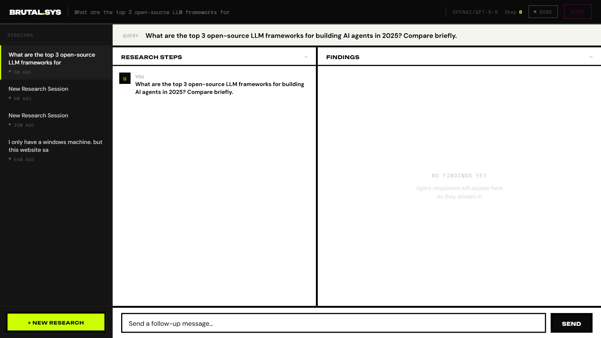
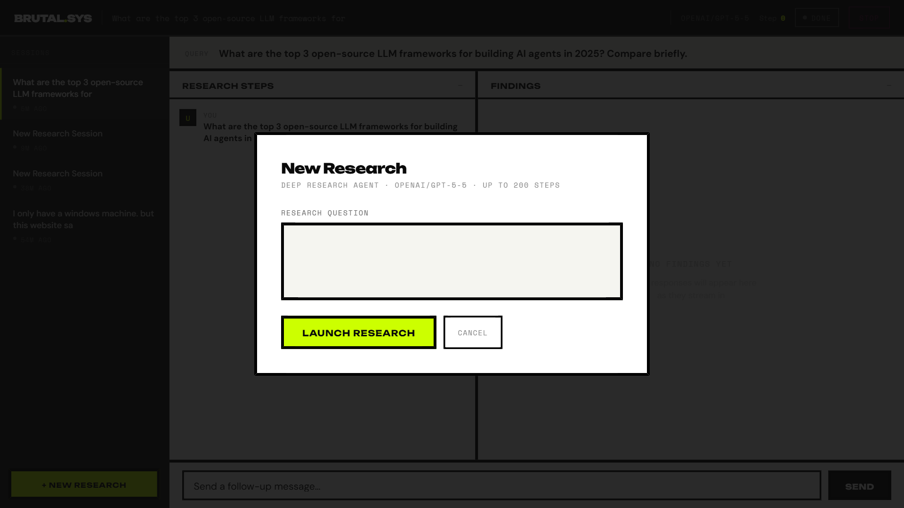
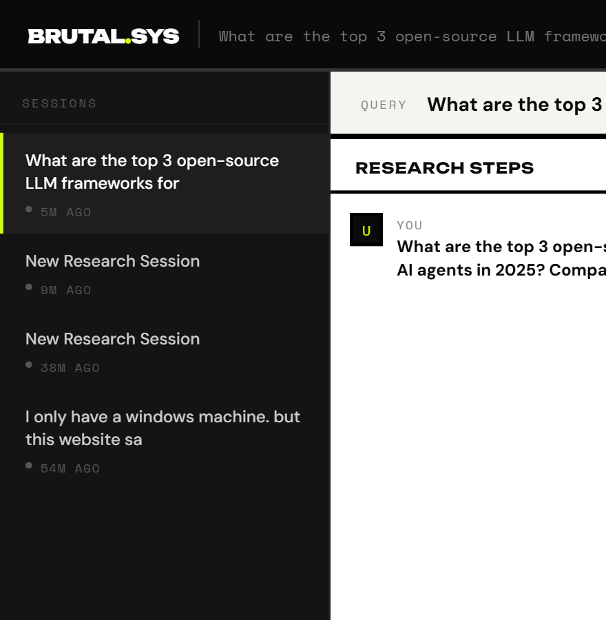

# TrueForge — Deep Research Agent UI

A Neo-Brutalist frontend for the [TrueForge](https://github.com/truefoundrycloud/trueforge) `deep-research-agent`, wired live to the TrueForge REST API with Server-Sent Events streaming.



---

## Features

- **Live SSE streaming** — research steps and findings update in real-time as the agent works
- **Sessions sidebar** — browse, create, and switch between research sessions
- **Approval gate** — when the agent pauses to ask a question (`ask_user_question`), an inline card with options appears; pick an option or type a free-text answer to resume
- **Historical replay** — select a past session and the full conversation reconstructs from the event log
- **Neo-Brutalist design** — acid green `#ccff00`, purple `#7000ff`, hot pink `#ff0099`, Unbounded 900 display font, heavy borders, hard box-shadows



---

## Prerequisites

| Requirement | Version |
|---|---|
| Node.js | 18 + |
| npm | 8 + |
| OpenAI API key with credits | (`openai/gpt-5-5`) |

---

## Installation

```bash
git clone https://github.com/ajosh87/trueforge-rote-fix.git
cd trueforge-rote-fix
npm install
```

`npm install` runs `postinstall` which:
1. Applies the patches in `patches/` via `patch-package`
2. Copies `_frontend/deep-research-agent.html` into TrueForge's static serving directory

---

## Configuration

Create a `.env` file or set environment variables before running:

```env
OPENAI_API_KEY=sk-...
```

TrueForge reads your agent configuration from `trueforge.config.yaml` (or equivalent). Make sure `deep-research-agent` is defined there with `model: openai/gpt-5-5` and `ask_user_questions.enabled: true`.

---

## Running

Start TrueForge with the Windows ESM path fix:

```bash
node --experimental-loader ./windows-esm-fix.mjs node_modules/@truefoundry/trueforge/dist/cli.js
```

TrueForge starts on **port 8790** by default.

---

## Opening the UI

Once TrueForge is running, open your browser to:

```
http://localhost:8790/deep-research-agent.html
```

The HTML is served directly from TrueForge's static file server — same origin as the API — so all API calls work with no CORS configuration.



---

## How It Works

### Starting a research session

1. Click **+ New Research** in the sidebar
2. Type your research question in the overlay
3. Click **Launch Research** — a new session is created and the first turn streams immediately

### Reading the results

| Panel | Contents |
|---|---|
| **Research Steps** (left) | Every action the agent takes: user messages, tool calls (web search, page fetch, etc.), approval gates |
| **Findings** (right) | The agent's narrative response, rendered as markdown |

### Approval gate

When the agent needs your input (e.g. to clarify scope or choose a direction) it pauses and a pink card appears in Research Steps:

- Click an option button to select it, then **Confirm**
- Or type a free-text answer and press **Send**

The agent resumes immediately after you respond.

---

## Project Structure

```
trueforge-rote-fix/
├── _frontend/
│   └── deep-research-agent.html   # The UI (tracked here, copied to node_modules on install)
├── patches/
│   └── @truefoundry+trueforge-core+0.1.4.patch   # Bug fixes for reasoning-content + provider handling
├── screenshots/                   # UI screenshots for this README
├── windows-esm-fix.mjs            # ESM loader hook for Windows absolute paths
└── package.json
```

---

## Patches Applied

| File | Fix |
|---|---|
| `VercelAILLM.js / .mjs` | Restrict thinking-block replay to `anthropic` and `openai` providers only (was crashing on Groq/other providers) |
| `toOpenAIChatMessage.js` | Strip `reasoning_content`, `thinking_blocks`, `source` fields from outbound messages to non-Anthropic providers |

---

## Troubleshooting

**`Request failed (429): You have no credits remaining`**
→ Your OpenAI account has run out of credits for `gpt-5-5`. Top up at [platform.openai.com/settings/organization/billing](https://platform.openai.com/settings/organization/billing).

**`Invalid prompt: messages must not be empty`**
→ A turn was submitted with no message body. This was a past bug (now fixed) — use the UI rather than the raw API.

**Page shows blank / API calls fail**
→ TrueForge is not running. Start it with the command above and refresh.

**Fonts not loading**
→ Requires internet access to [fonts.googleapis.com](https://fonts.googleapis.com) for Unbounded, DM Sans, Space Mono. Falls back to system fonts offline.
